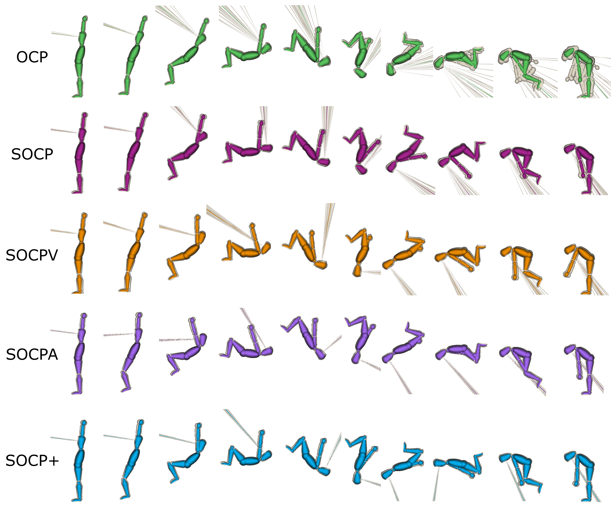

  

# Introduction
This repository contains the code to implement a predictive simulation of a planar rigid body avatar performing a backward tuck somersault. 
The predictive simulation is implemented using stochastic optimal control.
The goal of this study was to compare the following implementations:
1. OCP: deterministic optimal control problem with open-loop control
2. SOCP: stochastic optimal control problem with open-loop control, direct feedback control based on proprioceptive and vestibular information affected by random sensory noise of predefined magnitude, and random motor noise of predefined magnitude
3. $\text{SOCP}_{\text{VN}}$: stochastic optimal control problem with open-loop control, direct feedback control based on proprioceptive and vestibular information affected by random sensory noise modulated by the head angular velocity, and random motor noise modulated by the joint torque actuation
4. $\text{SOCP}^{\text{AF}}$: stochastic optimal control problem with open-loop control, direct feedback control based on proprioceptive and vestibular information affected by random sensory noise of predefined magnitude, anticipatory feedback control based on vestibular and visual information affected by random sensory noise of predefined magnitude, and random motor noise of predefined magnitude
5. $\text{SOCP}_{\text{VN}}^{\text{AF}}$: stochastic optimal control problem with open-loop control, direct feedback control based on proprioceptive and vestibular information affected by random sensory noise modulated by the head angular velocity, anticipatory feedback control based on vestibular and visual information affected by random sensory noise modulated by the head angular velocity and gaze orientation, and random motor noise modulated by the joint torque actuation

# Cite this work
This work has been submitted. 
TODO: add ref to the paper when it is accepted.

# Status
| Type | Status |
|---|---|
| Zenodo  |  |

# How to install dependencies
In order to run the code, you need to install the environment.yml

# Installing Bioptim from source
1. Install Bioptim from source [pyomeca/bioptim](https://github.com/pyomeca/bioptim).
You will then have to navigate to the commit `b0d8f43990c7a717600c6fb9387a6686e6244f0d` (i.e., `Stochastic_tag` from EveCharbie's fork), which is the version the results were generated with.
2. Install libhsl.so from [hsl](https://www.hsl.rl.ac.uk/download/MA57/3.11.3/). You will first need to request a license (free for academics).

# Codes to run
- `main_DMS.py`: This script runs all predictive simulations (watch out for the large computational time).
- `plot_optimal_solutions.py`: This script generates the solution analysis and figures.

# Contact
Do not hesitate to contact me if you have any questions or comments about this work [eve.charbie@gmail.com](mailto:eve.charbie@gmail.com).